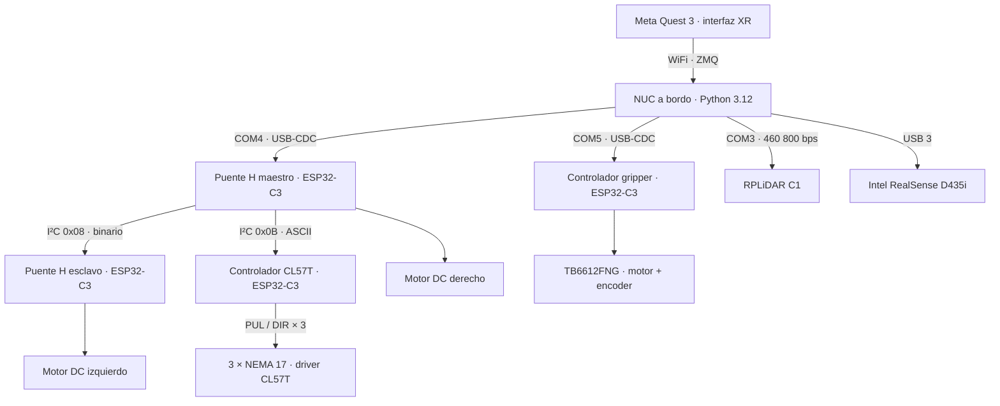

import { Artifact, ReplicationLevel } from '@project';

<figure>
  
  <figcaption>
    Un ESP32-C3 SuperMini sobre su placa. Los tres controladores del robot
    son el mismo módulo con firmware distinto.
  </figcaption>
</figure>

El software del robot se reparte en dos capas. La primera es el **firmware
embebido** de los tres controladores ESP32-C3, que esta página documenta. La
segunda es el **sistema de coordinación** que corre en la NUC, detallado en
[Servidor / percepción](/sistema/subsistemas/servidor-percepcion/).

## Los tres controladores

Los tres corren **MicroPython** sobre módulos **ESP32-C3 SuperMini**. Cada
uno resuelve una función de actuación distinta y habla con la NUC por I²C o
por USB-CDC. El detalle de cada uno vive en su propia página.

| Controlador | PCB | Comunicación con la NUC | Función |
| --- | --- | --- | --- |
| [Puente H](/sistema/subsistemas/robot-movil/electronica/) | Diseño propio (KiCad) | USB-CDC COM4 (maestro) | Motores DC de tracción |
| [CL57T](/sistema/subsistemas/robot-movil/controladores/cl57t/) | Diseño propio (KiCad) | I²C `0x0B` vía maestro | 3 ejes del manipulador |
| [Gripper](/sistema/subsistemas/robot-movil/controladores/gripper/) | Protoboard (sin PCB) | USB-CDC COM5 | Pinza — posición en mm |

El Puente H configurado como maestro (`DIP = 100`) concentra el bus I²C, así
que la NUC solo necesita un canal USB para mandar sobre los tres nodos de
movimiento. Los modos del DIP switch están en
[Electrónica](/sistema/subsistemas/robot-movil/electronica/#modos-de-operación-dip-switch);
la topología completa, más abajo.

<ReplicationLevel
  level="buildable"
  provides={[
    'Los tres firmwares completos, con pinout y protocolo documentados',
    'Mapa de direcciones del bus I²C y reparto de puertos USB',
    'Archivos de fabricación y BOM de las dos PCB de diseño propio',
  ]}
  missing={[
    'Números de parte de proveedor en ambos BOM',
    'Diagrama de cableado entre las placas, los drivers y las fuentes de alimentación',
    'Procedimiento de flasheo de MicroPython paso a paso, con la versión de intérprete usada',
  ]}
/>

## Requisitos

El software debía cumplir cuatro condiciones:

- Un firmware ligero y estable para controlar motores en tiempo real.
- Un sistema de coordinación que integre percepción, comunicación ZMQ y
  control de actuadores.
- Ninguna dependencia de ROS. Fue una decisión explícita de simplicidad y
  portabilidad, registrada en
  [ADR-0001](/registro/decisiones/0001-nuc-como-coordinador/).
- Una interfaz de depuración siempre disponible, por USB-C.

## Código fuente

Las dos capas, completas. El coordinador de la NUC es el programa más grande
del proyecto y el que une todo lo demás: percepción, comunicación con el
operador y mando de los tres controladores embebidos.

<Artifact href="/software/nuc_master_code.py" name="Coordinador de la NUC — nuc_master_code.py" />
<Artifact href="/firmware/main_movil_final.py" name="Firmware de tracción — main_movil_final.py" />
<Artifact href="/firmware/main_manipulador_final.py" name="Firmware del manipulador — main_manipulador_final.py" />
<Artifact href="/firmware/main_gripper_final.py" name="Firmware del gripper — main_gripper_final.py" />

| Firmware | Controlador | Líneas | Estado |
| --- | --- | ---: | --- |
| `main_movil_final.py` | Puente H | 1 175 | Funcional |
| `main_manipulador_final.py` | CL57T | 933 | Funcional |
| `main_gripper_final.py` | Gripper | 703 | Funcional |

## Topología de comunicación completa

Del operador al motor. Cada arista lleva el medio físico y, donde aplica, la
dirección o el puerto por el que viaja.

El detalle de los puertos y tópicos ZMQ está en
[Middleware](/sistema/subsistemas/servidor-percepcion/middleware/).

## Estado actual (última verificación conocida)

| Funcionalidad | Estado |
| --- | --- |
| Firmware Puente H — todos los modos de comunicación | Funcional |
| Firmware CL57T — homing, movimiento, compensación de muñeca | Funcional |
| Firmware gripper — posición mm, stall, calibración JSON | Funcional |
| Control de motores individual por USB-C | Verificado |
| Control por WiFi y BLE | Verificado |
| Integración de control de base desde interfaz XR | Funcional |
| Control completo del manipulador 3 GDL | Funcional |
| Control del gripper desde interfaz XR | Funcional |
