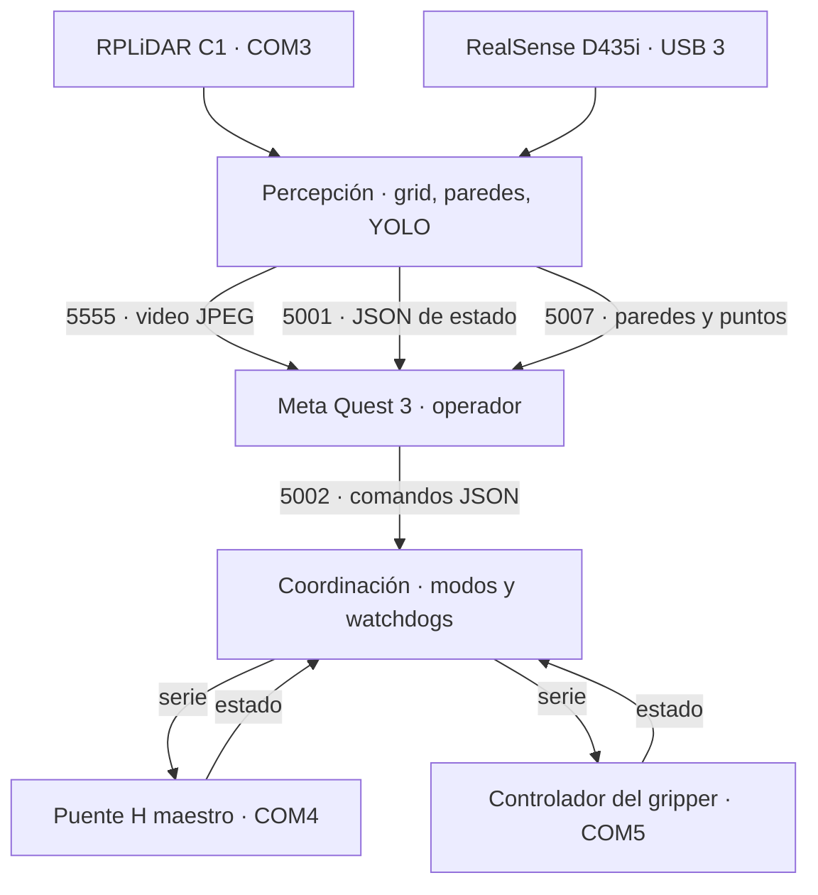

import { StatusBadge, InterfaceTable } from '@project';

Pese al nombre, este subsistema no corre en ningún servidor externo. La
**NUC (Intel NUC i7)** viaja a bordo del robot y hace de nodo central de
percepción, procesamiento y coordinación.

Sobre ella corre un backend en **Python 3.12 con ZeroMQ**, sin ROS. Esa
ausencia de ROS fue una decisión deliberada, registrada en
[ADR-0001](/remote-hands/registro/decisiones/0001-nuc-como-coordinador/).

## Responsabilidades

- Adquirir los datos de los sensores: RealSense D435i y RPLiDAR C1.
- Procesar solo lo que el modo activo requiere —visión YOLOv8, grid de
  LiDAR o pipeline de paredes—, de modo que los modos inactivos no consuman
  CPU ni red.
- Publicar video, sensores y datos binarios por ZeroMQ.
- Recibir los comandos que envía Unity: modos, movimiento, manipulador y
  gripper.
- Hacer de puente serie hacia el Puente H maestro (COM4) y hacia el gripper
  (COM5).

## Flujo de datos

Todo lo que entra y sale de la NUC. Los sensores y los controladores cuelgan
de puertos físicos; el operador, de los cuatro canales ZeroMQ.

La NUC no reenvía comandos tal cual: los traduce. Un `drive_cmd` con
velocidades `v`/`w` del modelo uniciclo se convierte en consignas por motor
antes de salir por COM4, y un `manip_cmd` en grados se convierte en la trama
ASCII `POSE` que entiende el controlador del manipulador.

## Componentes

- **[Middleware ZMQ](/remote-hands/sistema/subsistemas/servidor-percepcion/middleware/)**
  — puertos, tópicos, comandos y puentes serie.
- **[Percepción](/remote-hands/sistema/subsistemas/servidor-percepcion/percepcion/)**
  — pipeline de la RealSense y del RPLiDAR.
- **[Verificación](/remote-hands/sistema/subsistemas/servidor-percepcion/verificacion/)**
  — frecuencias medidas por canal y pruebas pendientes.

## Qué se puede replicar

Es el subsistema más replicable del proyecto: todo su comportamiento vive en
un archivo de código que sí está publicado.

<InterfaceTable
  caption="Nivel de replicación por parte"
  columns={['Parte', 'Nivel', 'Qué lo limita']}
  rows={[
    ['Middleware ZMQ', 'Reproducible', 'Faltan versiones fijadas de las dependencias'],
    ['Percepción', 'Reproducible', 'Los pesos de YOLO se descargan aparte, en el primer arranque'],
  ]}
/>

El hardware sí impone condiciones que el código no puede resolver: hacen
falta una RealSense D435i con el SDK de Intel instalado y un RPLiDAR C1. Sin
ellos el proceso arranca, porque los imports son tolerantes a fallo, pero se
queda sin percepción.

## Estado del subsistema

| Funcionalidad | Estado |
| --- | --- |
| Streaming ZMQ (video + LiDAR + estado) | <StatusBadge label="Verificado" tone="ok" /> |
| Control de base móvil y manipulador | <StatusBadge label="Implementado" tone="ok" /> |
| Telemetría de manipulador y gripper | <StatusBadge label="Implementado" tone="ok" /> |
| Modos inmersivos (paredes, puntos LiDAR) | <StatusBadge label="Implementado" tone="ok" /> |
| Watchdog ZMQ con paro seguro completo | <StatusBadge label="Parcial" tone="warn" /> |
